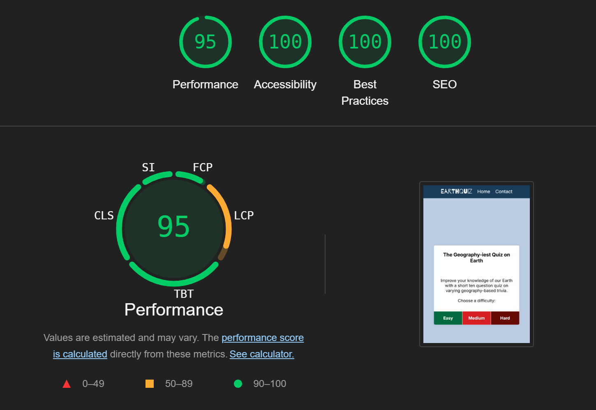
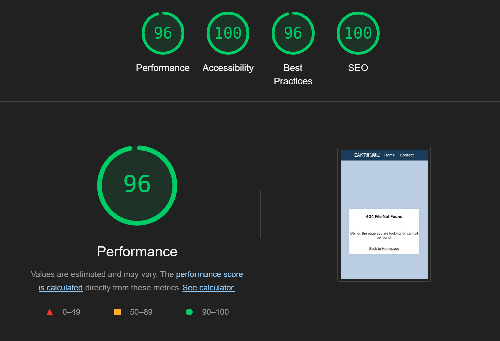
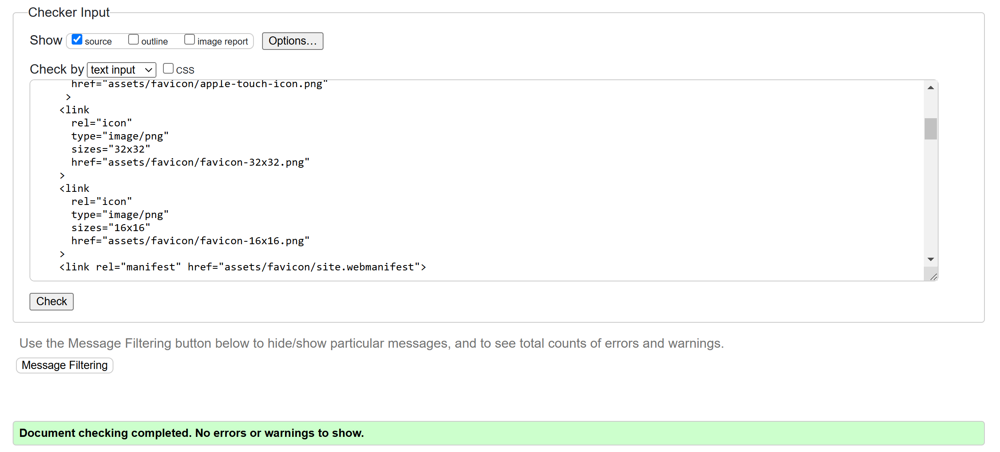
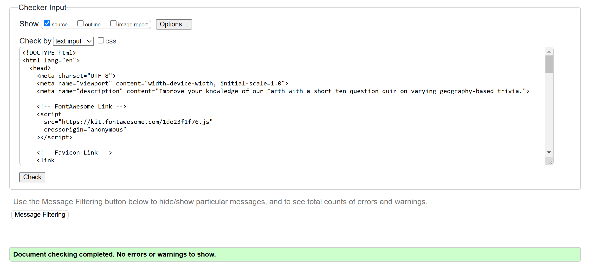
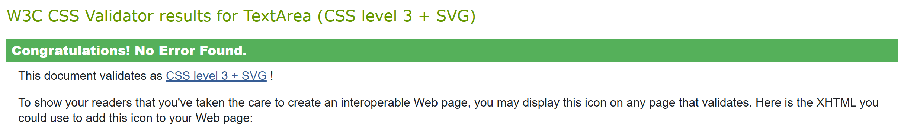

## Testing

### Responsiveness

All pages were tested to ensure responsiveness on screen sizes from 320px and upwards as defined in [WCAG 2.1 Reflow criteria for responsive design](https://www.w3.org/WAI/WCAG21/Understanding/reflow.html) on Chrome, Edge, Firefox and Opera browsers.

Steps to test:

1. Open browser and navigate to [EarthQuiz](?)
2. Open the developer tools (right click and inspect)
3. Set to responsive and decrease width to 320px
4. Set the zoom to 50%
5. Click and drag the responsive window to maximum width

Expected:

Website is responsive on all screen sizes and no images are pixelated or stretched.
No horizontal scroll is present.
No elements overlap.

Actual:

Website behaved as expected.

Website was also opened on the following devices and no responsive issues were seen:

- Samsung A15
- iPad Pro
- Lenovo Ideapad S540

### Accessibility

Wave Accessibility tool was used throughout development and for final testing of the deployed website to check for any aid accessibility testing.

Testing was focused to ensure the following criteria were met:

- All forms have associated labels or aria-labels so that this is read out on a screen reader to users who tab to form inputs
- Color contrasts meet a minimum ratio as specified in WCAG 2.1 Contrast Guidelines
- Heading levels are not missed or skipped to ensure the importance of content is relayed correctly to the end user
- All content is contained within landmarks to ensure ease of use for assistive technology, allowing the user to navigate by page regions
- All not textual content had alternative text or titles so descriptions are read out to screen readers
- HTML page lang attribute has been set
- Aria properties have been implemented correctly
- WCAG 2.1 Coding best practices being followed
- Manual tests were also performed to ensure the website was accessible as possible and an accessibility issue was identified.

### Lighthouse Testing

#### __Home Page__

#### __404 Page__

### Functional Testing

**Navigation Links**

Testing was performed to ensure all navigation links on the respective pages, navigated to the correct pages as per design. This was done by clicking on the navigation links on each page.

| Navigation Link | Page to Load        |
| --------------- | ---------------     |
| Home            | index.html          |
 |

Links on all pages navigated to the correct pages as exptected.

**Page Links**

?

### Validator Testing 

HTML
  - No errors were returned when passing through the official [W3C Validator](https://validator.w3.org)

  

  

CSS
  - No errors were found when passing through the official [Jigsaw Validator](https://jigsaw.w3.org)
  
  

### Fixed Bugs

*

*

*

### Unfixed Bugs

*

*

